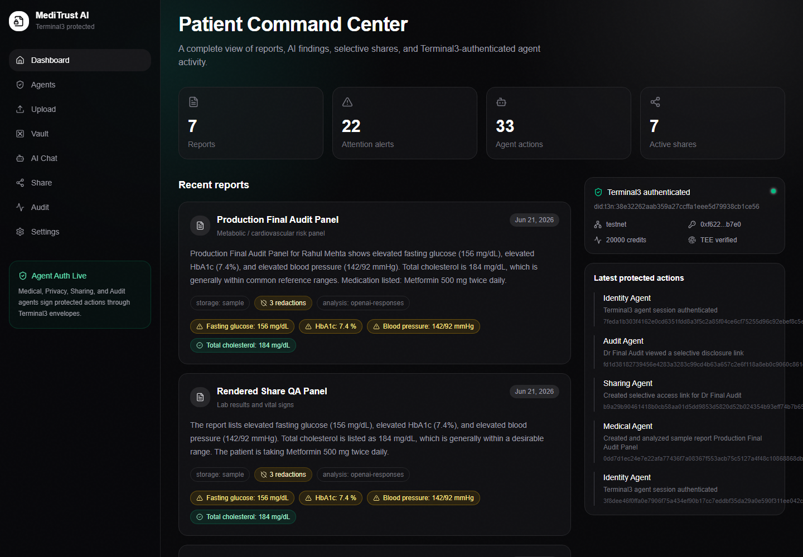
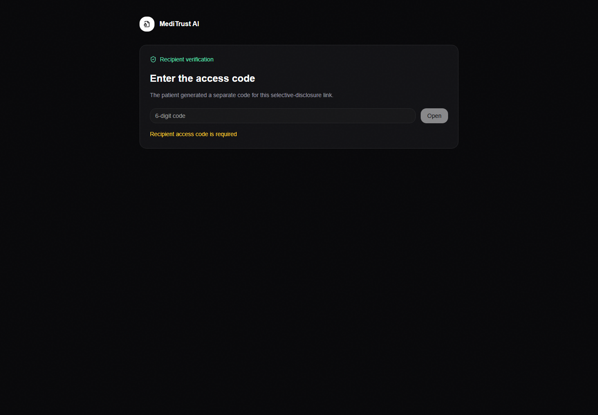
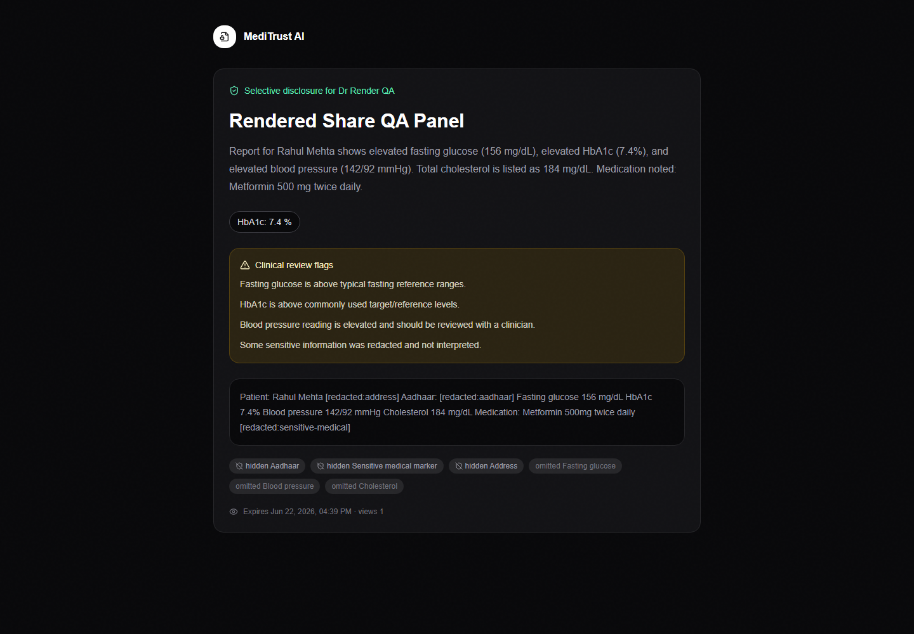
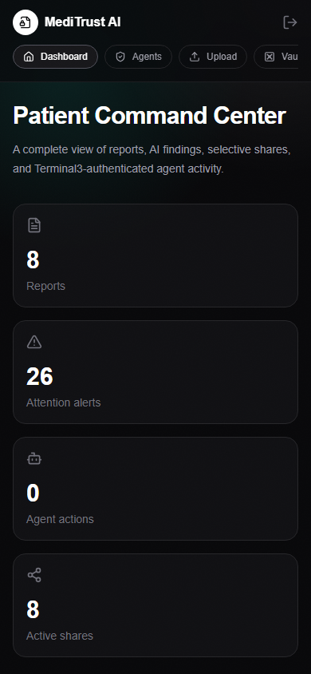

# MediTrust AI

[](https://meditrust-ai.vercel.app)
[](https://meditrust-ai-api.onrender.com/health)
[](https://docs.terminal3.io/developers/adk/overview/what-is-adk)

MediTrust AI is a privacy-first medical report vault and assistant built for the Terminal3 Agent Developer Kit challenge. It lets a patient upload medical reports, generate AI explanations, redact sensitive fields, create expiring selective-disclosure links, and review an audit trail for every protected action.

The app is designed around a simple rule: doctors, insurers, and care providers should only receive the fields they actually need.

## Live Links

- Live app: [meditrust-ai.vercel.app](https://meditrust-ai.vercel.app)
- Backend health: [meditrust-ai-api.onrender.com/health](https://meditrust-ai-api.onrender.com/health)
- Hackathon challenge: [Terminal3 ADK Developer Challenge](https://dorahacks.io/hackathon/t3adkdevchallenge/detail)
- Terminal3 Agent Developer Kit: [ADK overview](https://docs.terminal3.io/developers/adk/overview/what-is-adk)
- Terminal3 Network: [T3N overview](https://docs.terminal3.io/t3n/overview/what-is-t3n)
- Terminal3 platform: [About Terminal3](https://docs.terminal3.io/intro/about-t3) and [platform overview](https://docs.terminal3.io/intro/platform)

## Product Preview

Screenshots below were captured from the deployed production app during the final QA pass.

<p align="center">
  
</p>

<p align="center">
  
  
  
</p>

## What It Does

- Starts a Terminal3-backed patient session and stores a short-lived MediTrust session token.
- Uploads PDFs, images, prescriptions, and text reports.
- Extracts text with PDF parsing or OCR.
- Encrypts raw extracted report text before storing it.
- Masks Aadhaar, address, phone, email, and sensitive medical markers.
- Uses OpenAI Responses API when configured, with a deterministic local fallback.
- Lets users ask privacy-safe questions about their saved reports.
- Creates expiring share links with a separate recipient access code.
- Hides bearer share tokens from normal share-list responses after creation.
- Records user-scoped audit events with Terminal3 DID, agent role, SDK name, digest, TEE status, and timestamp.
- Shows Terminal3 authentication, usage, agent manifest, and TEE attestation status.

## Core Workflow

1. Patient signs in from `/login`.
2. Backend authenticates the Terminal3 SDK session and returns a signed MediTrust session token.
3. Patient uploads a report or creates the demo blood panel from `/upload`.
4. Backend extracts text, encrypts raw OCR text, masks sensitive content, analyzes medical values, and records an audit event.
5. Patient asks questions in `/chat`; answers use only privacy-safe report context.
6. Patient creates a share in `/share`; the app returns a one-time link plus a separate access code.
7. Recipient opens `/share/[token]` and enters the code before seeing the redacted snapshot.
8. Patient reviews actions in `/audit`.

## Pages

- `/` - product landing page.
- `/login` - Terminal3-backed session start.
- `/dashboard` - authenticated overview of reports, alerts, shares, and protected actions.
- `/agents` - Medical, Privacy, Sharing, Identity, and Audit agent mesh.
- `/upload` - upload/OCR/analyze flow and demo report creation.
- `/vault` - report vault by category.
- `/chat` - report-grounded medical assistant.
- `/share` - selective sharing and revocation.
- `/share/[token]` - public recipient view protected by access code.
- `/audit` - user-scoped audit trail.
- `/settings` - privacy mode, default expiry, Terminal3 provisioning, and attestation checks.

## Terminal3 Integration

The backend uses `@terminal3/t3n-sdk` in `backend/src/services/terminal3Service.js`.

Current SDK surfaces:

- `setEnvironment("testnet")`
- `loadWasmComponent()`
- `eth_get_address(...)`
- `T3nClient(...)`
- `metamask_sign(...)`
- `client.handshake()`
- `client.authenticate(...)`
- `TenantClient(...)`
- `client.getUsage(...)`
- `client.getAuditEvents(...)`
- `redactSecrets(...)`
- ML-KEM public key fetch and DKG attestation verification
- optional `tenantClient.maps.create(...)` for `secrets`, `meditrust-reports`, `meditrust-shares`, and `meditrust-audit`

The application defines separate Identity, Medical, Privacy, Sharing, and Audit agents. Each workflow stores a protected-action envelope containing the agent role, action scope, Terminal3 DID, environment, redacted payload, canonical digest, and TEE verification flag.

For deeper production enforcement, publish/configure a Terminal3 tenant contract and set `T3N_MEDICAL_CONTRACT_ID`. Without that value, the app runs in authenticated session mode and reports that map provisioning is session-only.

## Security Model

- Private API routes require a signed MediTrust bearer token.
- Reports, shares, settings, and audit records are scoped by `ownerDid`.
- Raw extracted report text is encrypted with AES-256-GCM before storage.
- Client responses omit raw OCR text, encrypted OCR blobs, access-code hashes, token hashes, and stored share-token values.
- New share links require a separate recipient access code.
- Cloudinary uploads use authenticated delivery metadata when configured.
- Express hides `X-Powered-By`, applies Helmet headers, and uses API rate limiting.
- CORS is restricted to configured frontend origins.

This is still an educational medical-record assistant, not a medical device. It does not diagnose and does not replace licensed clinical care.

## Tech Stack

- Frontend: Next.js, React, TypeScript, Tailwind CSS, shadcn-style components, Framer Motion.
- Backend: Node.js, Express, MongoDB, Multer, PDF parsing, OCR.
- AI: OpenAI Responses API with local fallback.
- Auth and agent trust: Terminal3 Agent Auth SDK / T3N testnet.
- Storage: MongoDB plus optional Cloudinary.
- Deployment: Vercel frontend and Render backend.

## Local Setup

Backend:

```bash
cd backend
npm install
cp .env.example .env
npm run smoke
npm run dev
```

Frontend:

```bash
cd frontend
npm install
cp .env.example .env.local
npm run dev
```

Required local frontend variable:

```bash
NEXT_PUBLIC_API_URL=http://localhost:4000/api
```

## Backend Environment

Set these in `backend/.env` locally and Render environment variables in production:

```bash
PORT=4000
NODE_ENV=production
FRONTEND_URL=https://meditrust-ai.vercel.app
ALLOWED_ORIGINS=https://meditrust-ai.vercel.app

MONGODB_URI=
MONGODB_DB=meditrust_ai

OPENAI_API_KEY=
OPENAI_MODEL=gpt-5.5

SESSION_SECRET=
SESSION_TTL_HOURS=12
DATA_ENCRYPTION_KEY=
RATE_LIMIT_WINDOW_MS=900000
RATE_LIMIT_MAX=240

T3N_API_KEY=
TERMINAL3_DID=
T3N_ENVIRONMENT=testnet
T3N_NODE_URL=
T3N_MEDICAL_CONTRACT_ID=

CLOUDINARY_CLOUD_NAME=
CLOUDINARY_API_KEY=
CLOUDINARY_API_SECRET=
```

Use strong random values for `SESSION_SECRET` and `DATA_ENCRYPTION_KEY`. Keep all real secrets in ignored local env files or provider secret managers.

## Deployment

Frontend is configured for Vercel with `frontend/vercel.json`.

Backend is configured for Render with `render.yaml`. Secret values are declared with `sync: false`; set them in the Render Dashboard or with a Render API/MCP tool that can update service environment variables.

After changing backend env vars, redeploy the Render service so the API process reads the new values.

## Verification

Backend:

```bash
cd backend
npm run smoke
npm audit --omit=dev
```

Frontend:

```bash
cd frontend
npm run lint
npm run build
npm audit --omit=dev
```

Production checks:

- `GET /health` should return `ok: true`.
- Private endpoints like `/api/reports` should return `401` without a session.
- Login should return a session token.
- Share creation should return a one-time link and access code.
- Share listing should not expose token or access-code secrets.
- Public share should require the access code.
- `/api/t3/status` should show Terminal3 authenticated after login.
- `/api/t3/attestation?refresh=true` should show verified TEE data when the node exposes attestation.

## Repository Layout

```text
backend/
  src/
    middleware/
    routes/
    services/
    utils/
frontend/
  app/
  components/
  hooks/
  lib/
  public/
docs/
  images/
render.yaml
project.md
README.md
```
